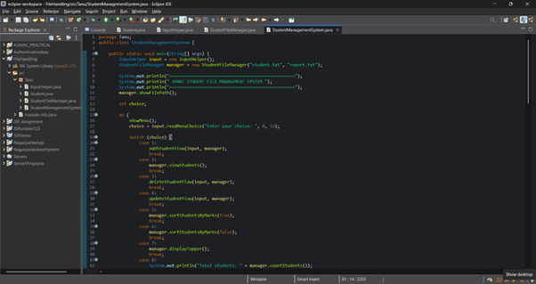
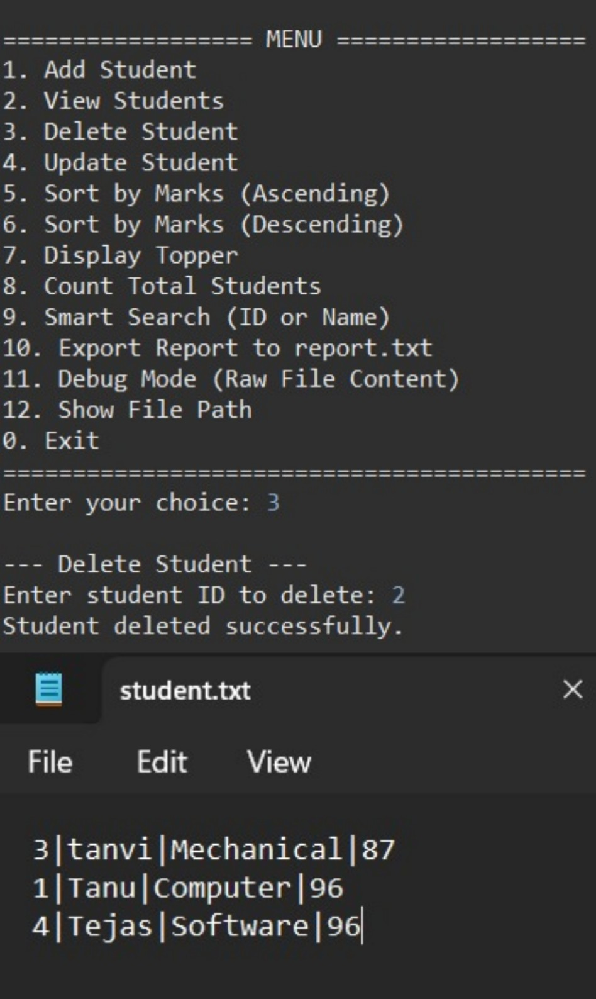

# 🎓 Student Management System (Java)

## 📖 Overview

The **Student Management System** is a console-based application developed in Java that enables efficient management of student records using file handling techniques. This project is designed to demonstrate strong fundamentals in **Object-Oriented Programming (OOP)**, **file operations**, and **modular application design**.

It serves as a foundational system for managing structured data without relying on external databases.

---

## 🚀 Features

* ➕ Add new student records with relevant details
* 📋 View all stored student data
* 🔍 Search for students based on input criteria
* ❌ Delete existing student records
* 💾 Persistent data storage using text files

---

## 🛠️ Tech Stack

| Category             | Technology Used                       |
| -------------------- | ------------------------------------- |
| Programming Language | Java                                  |
| Core Concepts        | OOP (Encapsulation, Classes, Objects) |
| Storage Mechanism    | File Handling (Text Files)            |
| Development Tool     | Eclipse IDE / Any Java IDE            |

---

## 📂 Project Structure

```
FileHandling/
│── src/                     # Source code files
│   ├── InputHelper.java
│   ├── Student.java
│   ├── StudentFileManager.java
│   └── StudentManagementSystem.java
│
│── bin/                     # Compiled class files
│── student.txt              # Data storage file
│── report.txt               # Generated output/report
│── images/                  # Screenshots folder
│── README.md                # Project documentation
```

---

## ⚙️ System Design

The application follows a **modular design approach**:

* **Student Class** → Represents student entity and attributes
* **StudentFileManager** → Handles file operations (read/write)
* **InputHelper** → Manages user input
* **Main Class** → Controls application flow and menu system

---

## ▶️ Execution Guide

1. Clone the repository or download the project
2. Open the project in Eclipse or any Java IDE
3. Navigate to `StudentManagementSystem.java`
4. Run the application
5. Interact with the menu-driven interface via console

---

## 🔄 Workflow

1. User selects an operation from the menu
2. Input is taken via console
3. Data is processed using Java classes
4. Results are stored/retrieved from `student.txt`
5. Output is displayed to the user

---

## 📸 Project Demonstration

| Feature           | Screenshot                  |
| ----------------- | --------------------------- |
| 🏠 Main Menu      |         |
| ➕ Add Student     |  |
| 🔍 Search Student |       |
| ❌ Delete Student  |       |

> 📌 *Ensure all images are placed inside the `images/` folder in your project directory.*

---

## ⚠️ Limitations

* Console-based interface (no graphical UI)
* Uses flat file storage instead of a database
* Basic validation and exception handling
* Limited scalability for large datasets

---

## 🌱 Future Enhancements

* 🔗 Integration with relational databases (MySQL)
* 🖥️ GUI development using Swing or JavaFX
* ✅ Advanced validation and error handling
* 📊 Data visualization and reporting features
* 🌐 Conversion into web-based application (Spring Boot)

---

## 📌 Learning Outcomes

* Practical implementation of OOP concepts
* Understanding file handling in Java
* Building modular and maintainable applications
* Managing real-world data in structured format

---

## 👩‍💻 Author

**Tanuja Khatal**

---

## ⭐ Acknowledgment

This project is developed as part of academic learning to strengthen core Java programming and problem-solving skills.

---

> 💡 *This project represents a strong foundation for transitioning into advanced systems involving databases, web technologies, and scalable architectures.*
